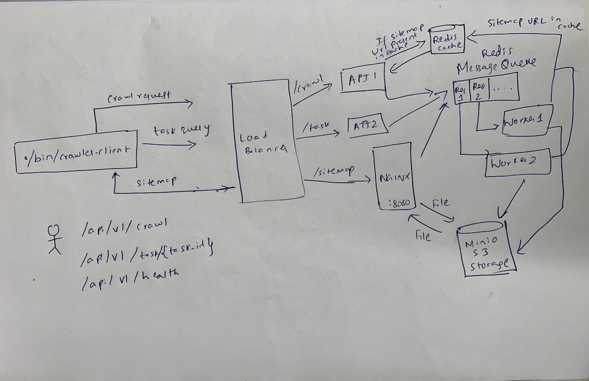

# web-crawler
A simple web crawler service including both server and client

# Running client and server

For client documentation refer [here](./client/README.md)

For server documentation refer [here](./server/README.md)

# Current flow

The flow goes like this

1. If the request is not in cache the request will be sent to the server worker crawler to crawl and the client gets an task_id for tracking.
2. Once the crawler's job is done the task status gets updated and the client will track the status of the job and once completed it will download the sitemap.
3. If present in the cache the client gets the pre_signed url from S3 bucket to download the site map and client can download the sitemap.

# Architecture

# Advantages of this approach

# Limitations of this approach

1. As of now the we are using minio for s3 subsitution
2. The crawler is written in python where I leveraged threadpool but the performance can be improved.
